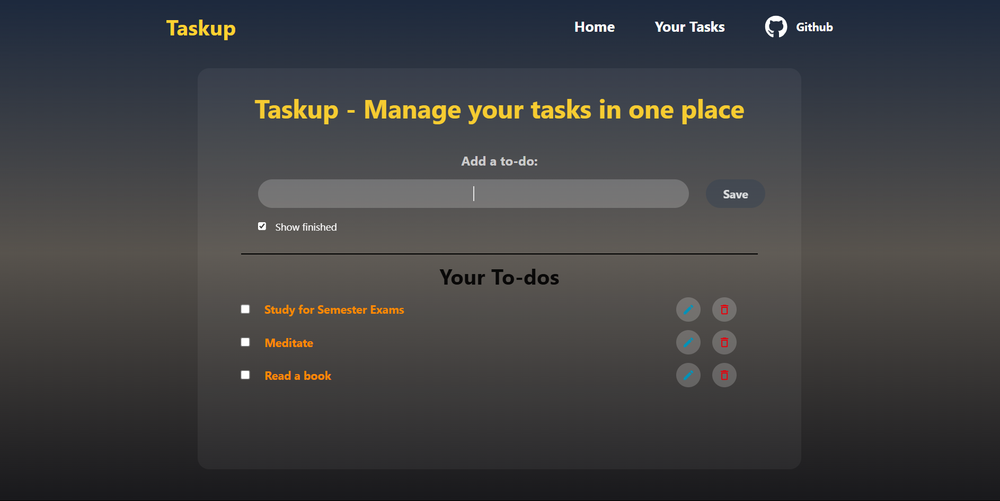

# ✅ TaskUp

**TaskUp** is a simple and responsive to-do app to help you manage tasks effectively — right in your browser.  
It features a clean and modern UI built with React and Vite.

### 🔗 Live Demo  
[🌐 View TaskUp](https://deepanshusaxena315.github.io/TaskUp-Task-Planner/)

---

## 🖼️ Screenshots



> _A clean and intuitive interface for managing your tasks with ease._

---

## ⚙️ Features

- ➕ Add new tasks  
- ✅ Mark tasks as complete  
- 🗑️ Delete tasks  
- 💾 Saves tasks in your browser using localStorage  
- ⚡ Fast and responsive UI with React + Vite

---

## 🧰 Tech Stack

- **Frontend**: React, Vite  
- **Storage**: localStorage  
- **Hosting**: GitHub Pages

---

## 🚀 Run Locally

```bash
git clone https://github.com/deepanshusaxena315/TaskUp-Task-Planner.git
cd TaskUp-Task-Planner
npm install
npm run dev
